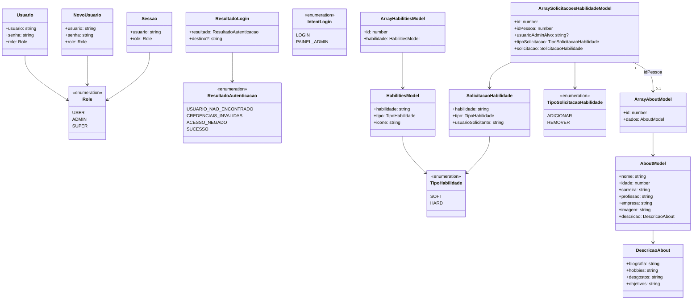

# Diagrama de classes

Entidades dos modelos de dados (`shared/models`) e seus relacionamentos, refletindo o estado
atual do código.

`ArraySolicitacoesHabilidadeModel.idPessoa` referencia o `id` de um `ArrayAboutModel` (a landing
page alvo da solicitação); `usuarioAdminAlvo` referencia o `usuario` do admin dono dessa landing
page (resolvido pelo vínculo interno de `PessoaService`, nunca armazenado como referência direta a
`Usuario`). Quando não há admin vinculado à landing page, `usuarioAdminAlvo` é `null` e a
solicitação só é visível para a role `super`.
